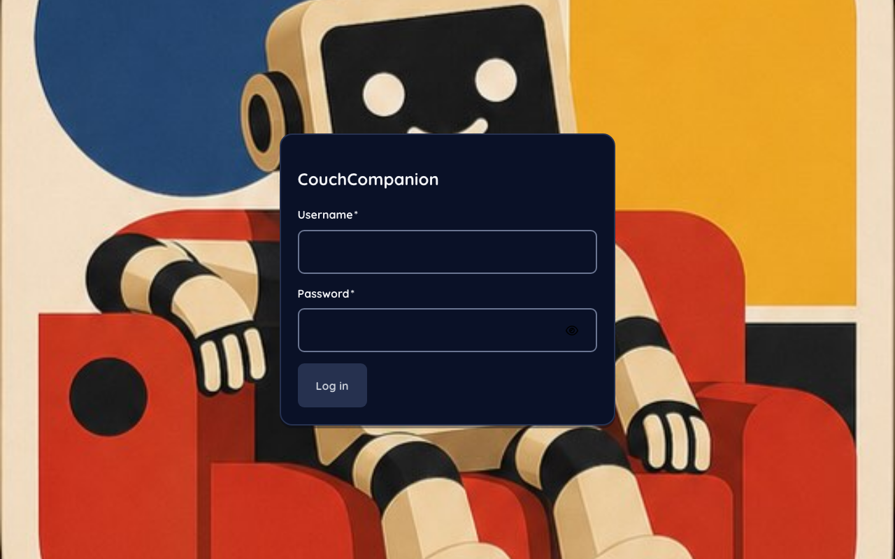
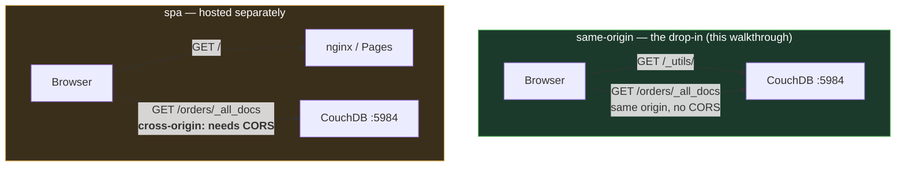
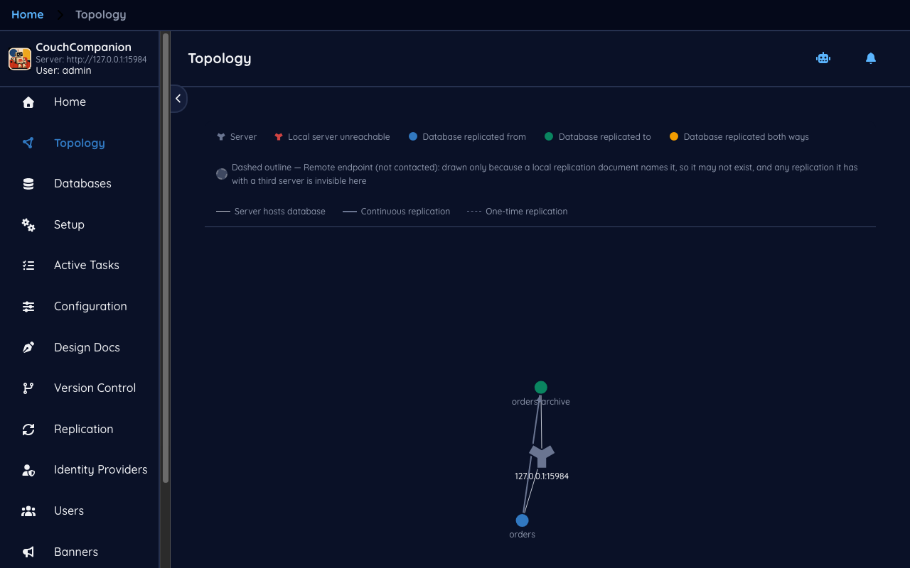
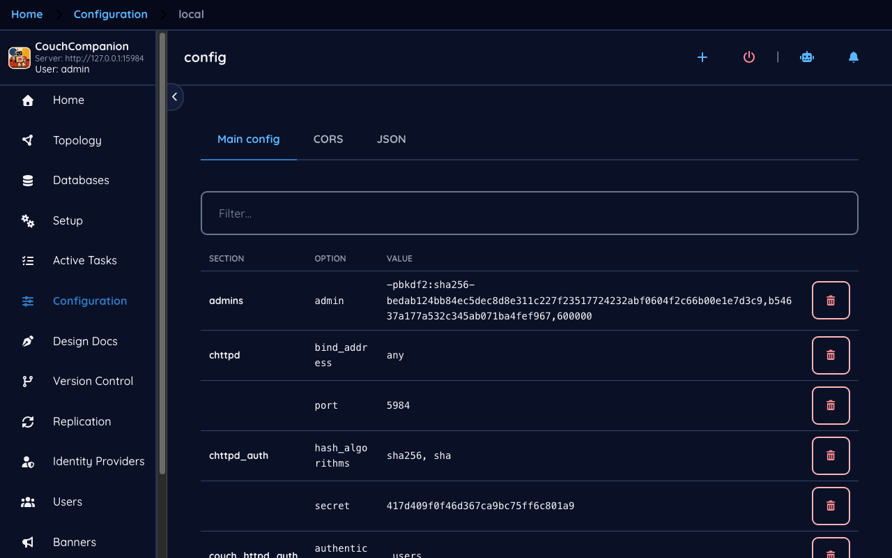
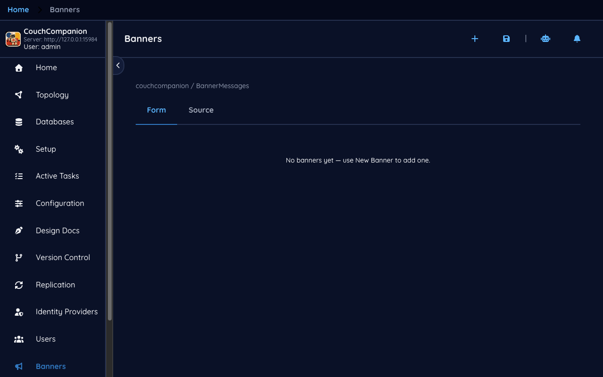

<!--
 Licensed to the Apache Software Foundation (ASF) under one
 or more contributor license agreements.  See the NOTICE file
 distributed with this work for additional information
 regarding copyright ownership.  The ASF licenses this file
 to you under the Apache License, Version 2.0 (the
 "License"); you may not use this file except in compliance
 with the License.  You may obtain a copy of the License at

   https://www.apache.org/licenses/LICENSE-2.0

 Unless required by applicable law or agreed to in writing,
 software distributed under the License is distributed on an
 "AS IS" BASIS, WITHOUT WARRANTIES OR CONDITIONS OF ANY
 KIND, either express or implied.  See the License for the
 specific language governing permissions and limitations
 under the License.
-->

# 1. First run

[← Index](README.md) · [Next: Databases →](02-databases.md)

## Signing in

Open `http://<your-server>:5984/_utils/`. Couch Companion asks for a username and password.

These are **CouchDB credentials, not application credentials**. Couch Companion has no user list
of its own; it hands what you type to CouchDB's `POST /_session` and keeps the cookie CouchDB
returns. If you can log in with `curl`, you can log in here, and if you cannot, no setting in this
application will change that.

> **New to CouchDB — who is the first user?**
> On a fresh CouchDB the first administrator is whoever the server was started with. In the
> container image that is `COUCHDB_USER` / `COUCHDB_PASSWORD`. A CouchDB with *no* administrator
> configured is in what CouchDB calls **admin party**: everyone is an admin and nothing is
> protected. If your server is in that state, fix it before anything else — see
> [Users and roles](07-users.md).

## Two ways this can be deployed

Which one you are in changes what the login screen asks for, so it is worth knowing.

Couch Companion works out which it is at startup by asking its own origin for `/_up`. When CouchDB
answers — the drop-in case — the server is fixed and the login screen shows only a username and
password. When it does not, the application knows it is hosted elsewhere and adds a **Companion
Server** field so you can say which CouchDB to talk to. That second mode needs CORS configured on
CouchDB; [install.md](../install.md#spa-install) covers it.

Everything in this walkthrough is the first case.

## The shell

After signing in you land on the application shell, which is the same on every page:

- **The left navigation** — Home, Topology, Databases, Setup, Active Tasks, Configuration, Design
  Docs, Version Control, Replication, Identity Providers, Users, Banners. It collapses with the
  chevron if you want the width back.
- **The identity block at the top left** shows which server you are on and who you are signed in
  as. Worth a glance before any destructive action.
- **Breadcrumbs across the top** track where you are — `local › orders › Documents` — and every
  segment is a link.
- **The theme picker** offers Light, Dark or System, plus four visual themes (Awesome, Default,
  Shoelace, Enchanted). The screenshots here use the default dark appearance.
- **The bell** collects notifications raised by long-running actions.

## Topology

**Topology** draws what this server is and what it is connected to.

The demo has one server, so the picture is small — which is the point of showing it early. The
node in the middle is the CouchDB you are signed in to. Around it sit the databases involved in
replication, coloured by direction: blue for replicated *from*, green for replicated *to*, amber
for both. Here `orders` feeds `orders-archive`, so `orders` is blue and `orders-archive` is green.

Two details in the legend matter later:

- **Solid vs dashed edges** — solid is a continuous replication, dashed is a one-time one.
- **A dashed outline** on a node means a remote endpoint that Couch Companion has *not* contacted.
  It is drawn only because a local replication document names it. It may not exist at all, and any
  replication it has with a third server is invisible from here.

That last point is the honest limit of this screen: it shows what *this* server knows, not the
whole topology of a cluster you may have. [Replication](06-replication.md) returns to it.

## Configuration

**Configuration** is a browsable, editable view of the same settings CouchDB keeps in its `.ini`
files, grouped by section.

> **New to CouchDB — where does configuration live?**
> CouchDB's configuration is layered: files under `etc/` (`default.ini`, then `local.ini`), and
> then anything written at runtime through the HTTP API, which lands in `local.ini` and takes
> effect immediately. This screen is that API. A value you change here is live at once and
> survives a restart — there is no separate "apply" or "reload" step, and equally no undo.

The sections you are most likely to touch as a new administrator are `httpd` and `chttpd`
(bindings and ports), `cors` (needed only for the SPA deployment), `couchdb` (`max_document_size`,
the data directory), and `log`. Two more — `oidc` and `jwt_keys` — are written for you by the
[Identity Providers](09-identity.md) screens; editing them by hand is possible but rarely what you
want.

## Banners

**Banners** lets you publish a message across the top of the UI for everyone who opens it —
planned maintenance, a migration in progress, a reminder that this is the production server.

It is a small feature with a specific use: the audience is other administrators looking at the
same CouchDB, and the message lives in the database rather than in any one person's browser.

---

Next: [Databases →](02-databases.md) — creating them, the ones CouchDB creates for itself, and
deciding who may read and write.
