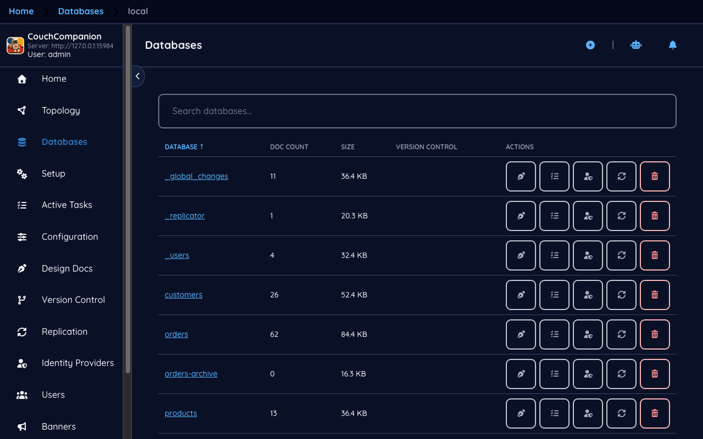
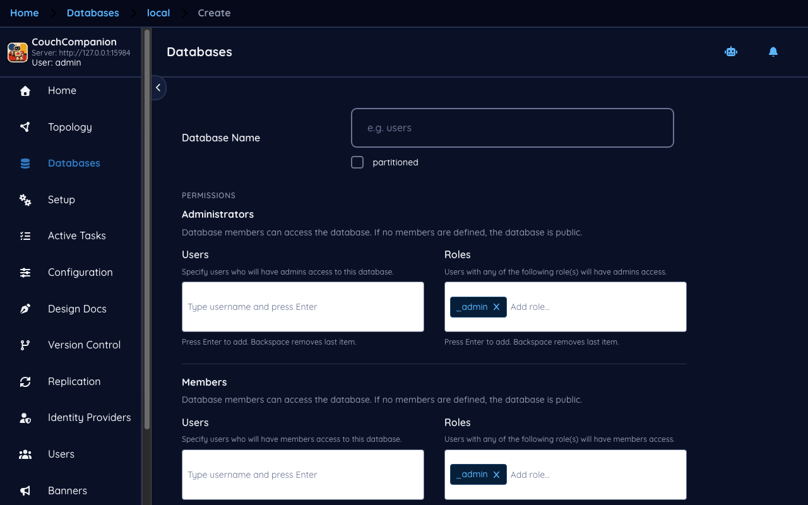
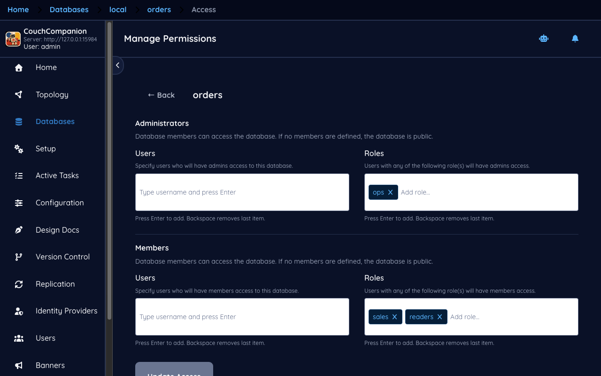
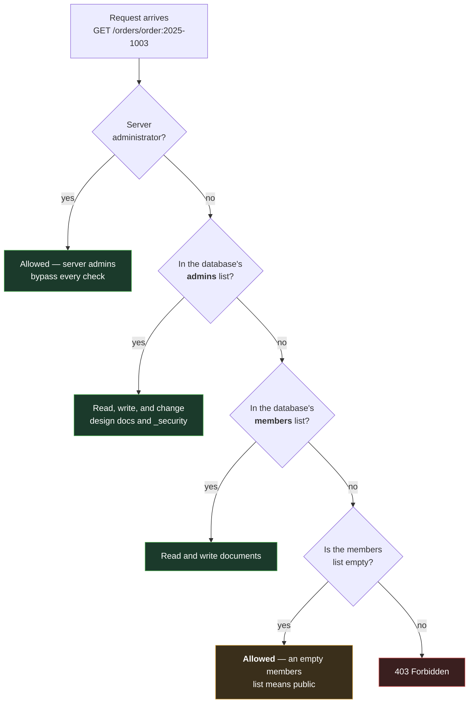

<!--
 Licensed to the Apache Software Foundation (ASF) under one
 or more contributor license agreements.  See the NOTICE file
 distributed with this work for additional information
 regarding copyright ownership.  The ASF licenses this file
 to you under the Apache License, Version 2.0 (the
 "License"); you may not use this file except in compliance
 with the License.  You may obtain a copy of the License at

   https://www.apache.org/licenses/LICENSE-2.0

 Unless required by applicable law or agreed to in writing,
 software distributed under the License is distributed on an
 "AS IS" BASIS, WITHOUT WARRANTIES OR CONDITIONS OF ANY
 KIND, either express or implied.  See the License for the
 specific language governing permissions and limitations
 under the License.
-->

# 2. Databases

[← First run](01-first-run.md) · [Index](README.md) · [Next: Documents →](03-documents.md)

## The database list

**Databases** in the left navigation lists every database on the server, with its document count
and on-disk size.

The demo databases are `customers`, `orders`, `products` and `orders-archive`. The three beginning
with an underscore are CouchDB's own.

> **New to CouchDB — the system databases**
> CouchDB keeps its own state in ordinary databases whose names start with `_`. You will see three
> on any healthy server:
>
> - **`_users`** — one document per account. This *is* the user directory; there is nowhere else.
> - **`_replicator`** — one document per replication. Writing a document here starts a
>   replication; deleting it stops one. See [Replication](06-replication.md).
> - **`_global_changes`** — a feed of database creations and deletions across the cluster.
>
> A CouchDB missing these has not finished its single-node setup. Nothing will obviously break at
> first, and then user accounts or replications will fail to save.

Two columns repay attention. **Doc Count** includes design documents, so a database showing 62
documents when you added 60 is normal — the extras are the views and indexes from later chapters.
It also excludes deleted documents, which still occupy space. **Size** is what the files actually
occupy, which is why it never drops when you delete documents; only compaction reclaims that.

## Creating a database

**Create Database** asks for a name and the two numbers that decide how CouchDB will store it.

> **New to CouchDB — `q` and `n`, and why you cannot change them later**
> CouchDB splits a database into **shards** (`q`) and keeps **copies** of each shard (`n`).
>
> - **`q`, the shard count** — how many pieces the data is cut into. More shards spread work
>   across more CPUs, but every query has to visit all of them, so a high `q` on a small database
>   is pure overhead. The default of 2 is right for most single-server databases.
> - **`n`, the replica count** — how many nodes hold a copy. On a single server this can only
>   ever be 1. On a three-node cluster, 3 is the usual answer.
>
> **Neither can be changed after creation.** Changing them means creating a new database with the
> values you want and replicating into it. That makes this small form the most consequential one
> in the application, which is why it is worth understanding before you use it rather than after.

Database names are also more restricted than you might expect: lowercase letters, digits, and
`_$()+-/` only, and the name must begin with a letter. `Orders` and `order-2026!` are both
rejected.

## Who may read and write

Select a database and open **Access** to see its permissions.

Each database carries a small `_security` document with two lists — **admins** and **members** —
and each list holds names and roles.

The amber box is the one that surprises people, and the screen says so in as many words: **if no
members are defined, the database is readable by anyone who can reach the server.** A database
with an empty `_security` is not "locked down by default" — it is open. New databases start that
way.

In the demo, `orders` is restricted: the `ops` role is an admin, and the `sales` and `readers`
roles are members. Note that these are *roles*, not usernames. Naming roles rather than people is
almost always the right choice — when someone joins the team you grant them a role in `_users`
rather than editing the `_security` of every database. [Users and roles](07-users.md) covers the
other half of this.

Two things `_security` deliberately cannot do:

- **It is per database, not per document.** CouchDB has no row-level permissions. If two groups
  must not see each other's records, they need two databases — which, given how cheap replication
  is, is a more usual design in CouchDB than it would be elsewhere.
- **A member can write as well as read.** There is no read-only member. Read-only access is
  achieved with a `validate_doc_update` function in a design document, or by giving the reader a
  replica database they cannot write back to.

---

Next: [Documents →](03-documents.md) — the browser, the editor, and the `_rev` field that explains
most of CouchDB's behaviour.
