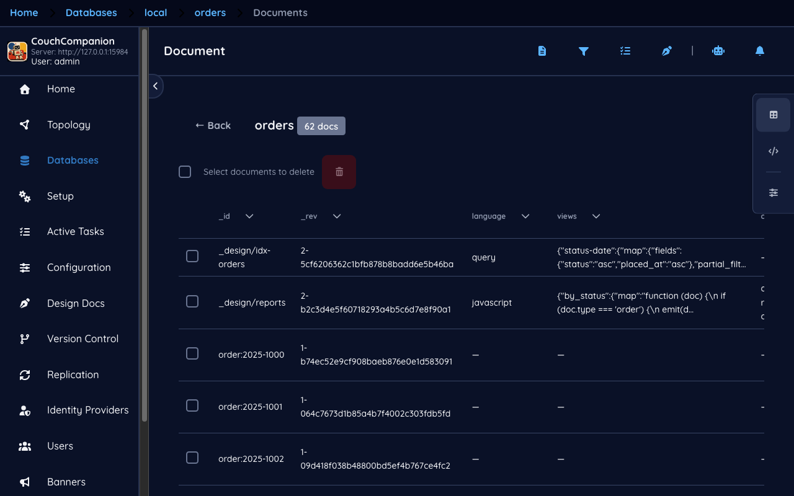
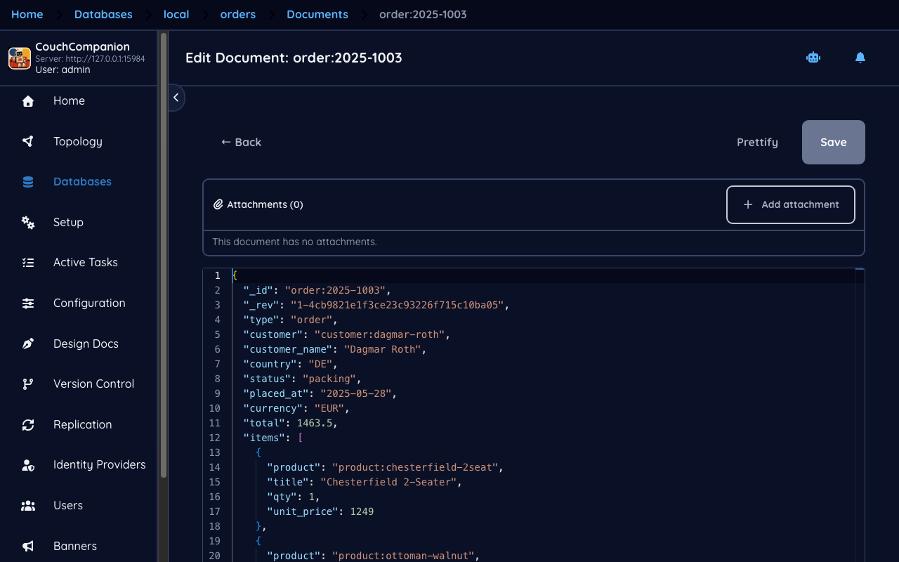
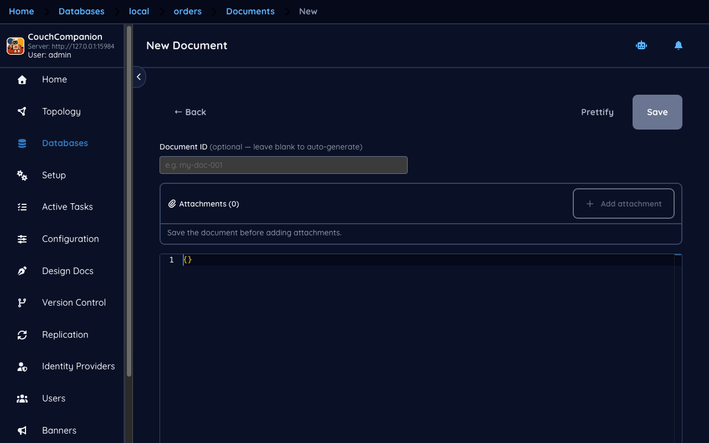
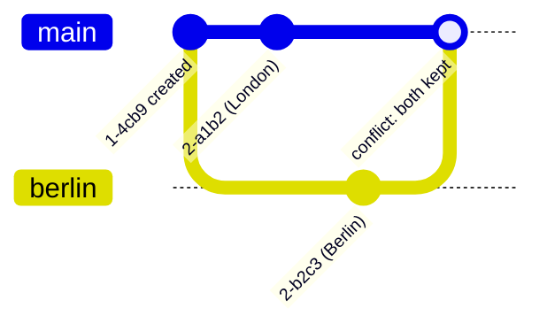

<!--
 Licensed to the Apache Software Foundation (ASF) under one
 or more contributor license agreements.  See the NOTICE file
 distributed with this work for additional information
 regarding copyright ownership.  The ASF licenses this file
 to you under the Apache License, Version 2.0 (the
 "License"); you may not use this file except in compliance
 with the License.  You may obtain a copy of the License at

   https://www.apache.org/licenses/LICENSE-2.0

 Unless required by applicable law or agreed to in writing,
 software distributed under the License is distributed on an
 "AS IS" BASIS, WITHOUT WARRANTIES OR CONDITIONS OF ANY
 KIND, either express or implied.  See the License for the
 specific language governing permissions and limitations
 under the License.
-->

# 3. Documents

[← Databases](02-databases.md) · [Index](README.md) · [Next: Queries and indexes →](04-queries.md)

## The document browser

Opening a database shows its documents in a table.

The columns are not fixed. Couch Companion samples the documents it has loaded, notices which
fields they share, and offers those as columns — which is why `language` and `views` appear here:
they come from the design documents sitting alongside the orders. The controls at the right edge
switch between the table and a raw JSON view, and open the column picker.

Design documents (`_design/…`) are listed with everything else because that is exactly what they
are: ordinary documents that CouchDB treats specially. [Design documents and
views](05-design-docs.md) takes them apart.

## The editor

Selecting a document opens it.

A CouchDB document is a JSON object, and the editor shows it as one — no form, no schema, because
CouchDB has neither. Two fields are CouchDB's rather than yours:

- **`_id`** — the document's identity, unique within the database, chosen by you or generated. The
  demo uses readable ids like `order:2025-1003`; CouchDB is equally happy with a UUID. A prefix
  convention like `order:` costs nothing and makes `_all_docs` ranges useful later.
- **`_rev`** — the revision, in the form `<n>-<hash>`. This is the field worth understanding.

> **New to CouchDB — `_rev` and MVCC**
> CouchDB never updates a document in place. Every write creates a *new revision* and the number
> in front of the hash goes up. To change a document you must send back the `_rev` you read; if
> someone else has written in the meantime, your `_rev` is stale and CouchDB rejects the write
> with **409 Conflict**. This is optimistic concurrency: no locks, no waiting, and no lost update.
>
> It follows that `_rev` is **not a version history**. Old revisions are kept only until the next
> compaction, and you cannot rely on reading one back. If you need history, write it into your own
> documents.

Above the JSON, the **Attachments** panel handles binary data — a PDF invoice, an image. CouchDB
stores attachments alongside the document and replicates them with it, which is genuinely useful,
though large attachments make databases expensive to replicate. A new document must be saved
before it can take an attachment, which the panel tells you.

**Prettify** reformats the JSON. **Save** performs the `PUT` — and if you have been editing while
someone else wrote, this is where the 409 appears.

## Creating a document

**New Document** opens the same editor over an empty object.

The **Document ID** field is optional, and leaving it blank is a real choice rather than
laziness: CouchDB then assigns a UUID. Sequential or time-ordered ids cluster writes onto one
shard; random ids spread them. For a database that is mostly appended to, letting CouchDB choose
is usually the better default.

There is no schema to satisfy. Any valid JSON object is a valid document, which is the freedom
that makes people either love CouchDB or distrust it. If you want a schema, you write a
`validate_doc_update` function in a design document, and CouchDB will run it on every write.

## Conflicts, and why they are normal

Because writes are optimistic and replication is asynchronous, two copies of a database can each
accept a change to the same document. When they meet, CouchDB does not pick a winner and discard
the loser — it keeps both and marks the document conflicted.

Both revisions are stored. CouchDB deterministically shows one of them as the winner — the same
one on every node, so replicas agree — and lists the other under `_conflicts`. Nothing is lost,
but nothing is resolved either: **CouchDB has told you there is a decision to make, and it is
still yours to make.** You resolve a conflict by writing the version you want and deleting the
other revision.

The demo database contains exactly this situation on `_design/reports`, created deliberately so
the behaviour is visible rather than theoretical.

> **This is not the same as the Conflicts screen.** Couch Companion's **Design Docs → Conflicts**
> page reports a different thing — design documents that differ between CouchDB and a Git
> repository. See [Version control](08-version-control.md).

## Deleting

Deleting a document does not remove it. CouchDB writes a new revision carrying `_deleted: true`, a
**tombstone**, which is what lets the deletion replicate: a server that has never seen the
document cannot be told about an absence, only about a record that says "deleted".

The practical consequences are worth knowing before they surprise you:

- Document counts drop but disk usage does not. Only compaction reclaims the space.
- Tombstones replicate, and they are kept indefinitely.
- A database used as a queue — write, process, delete — grows forever. If that is your pattern,
  rotate databases rather than deleting documents.

---

Next: [Queries and indexes →](04-queries.md) — finding documents without knowing their ids.
