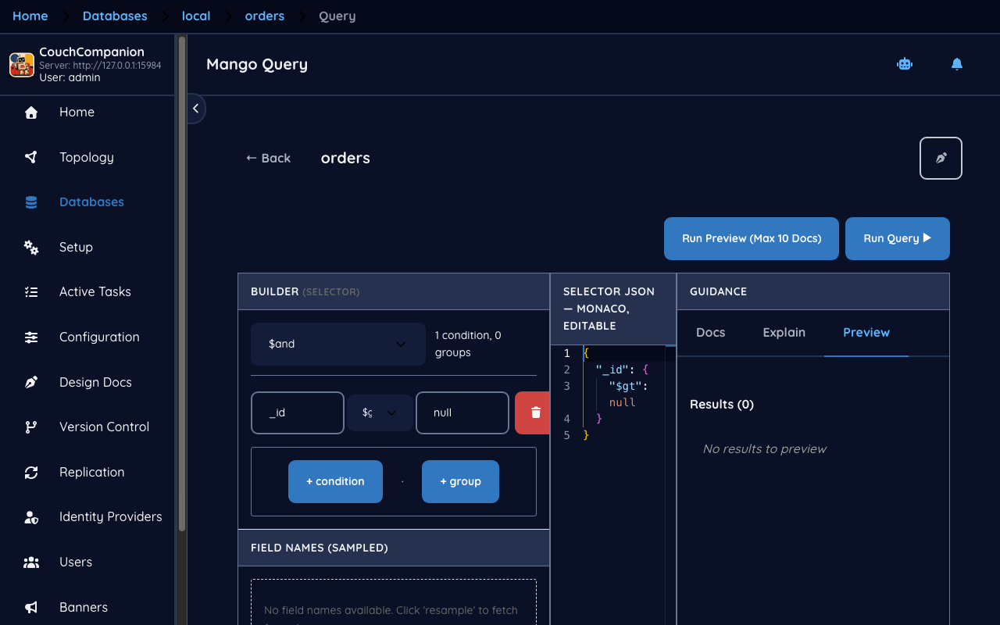
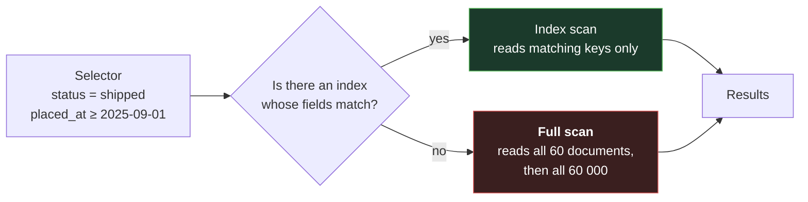
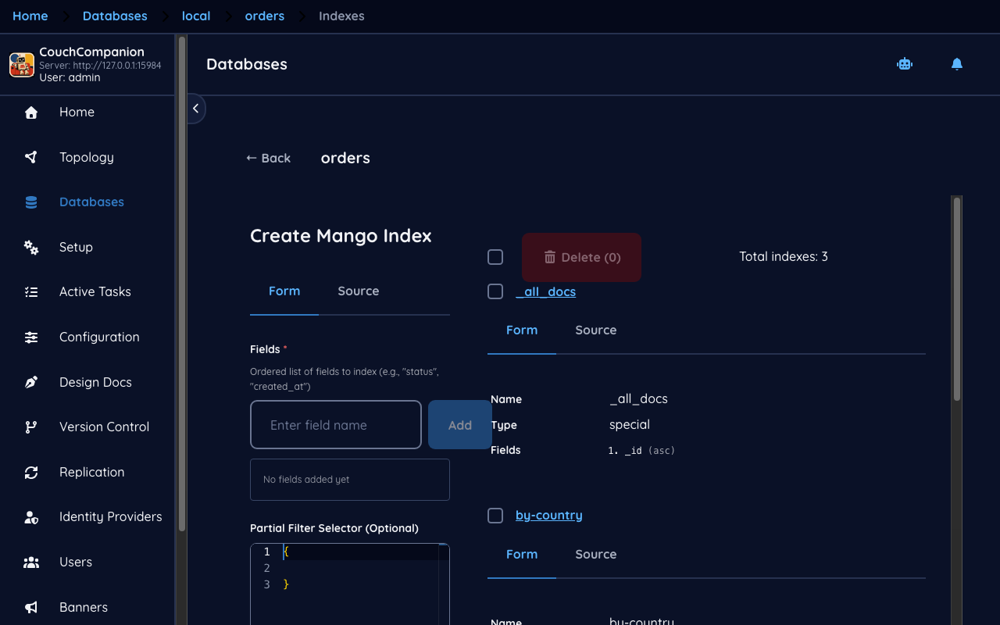

<!--
 Licensed to the Apache Software Foundation (ASF) under one
 or more contributor license agreements.  See the NOTICE file
 distributed with this work for additional information
 regarding copyright ownership.  The ASF licenses this file
 to you under the Apache License, Version 2.0 (the
 "License"); you may not use this file except in compliance
 with the License.  You may obtain a copy of the License at

   https://www.apache.org/licenses/LICENSE-2.0

 Unless required by applicable law or agreed to in writing,
 software distributed under the License is distributed on an
 "AS IS" BASIS, WITHOUT WARRANTIES OR CONDITIONS OF ANY
 KIND, either express or implied.  See the License for the
 specific language governing permissions and limitations
 under the License.
-->

# 4. Queries and indexes

[← Documents](03-documents.md) · [Index](README.md) · [Next: Design documents →](05-design-docs.md)

## Mango

CouchDB's declarative query language is called **Mango**. You describe the documents you want with
a JSON *selector* and CouchDB finds them. The **Query** tab on a database is a builder for exactly
that.



The builder assembles a selector from conditions joined by `$and`, `$or` or `$nor`, with the usual
operators — `$eq`, `$ne`, `$gt`, `$gte`, `$lt`, `$lte`, `$in`, `$exists`. The selector it produces
is plain JSON, and you can switch to editing it directly:

```json
{
  "selector": {
    "status": "shipped",
    "placed_at": { "$gte": "2025-09-01" }
  },
  "sort": [{ "placed_at": "desc" }],
  "limit": 25
}
```

Two conveniences are worth pointing out. **Field Names (Sampled)** offers field names taken from
documents the screen has actually read — useful in a schemaless database where nothing else can
tell you what fields exist; press **resample** to widen the sample. And **Run Preview (Max 10
Docs)** runs the query capped at ten results, which is the button to use while you are still
getting the selector right.

## Making it fast

A selector alone does not make a query fast. Without an index CouchDB will read *every* document
and test each one.



On the 60 documents in the demo you will not notice. On a real database you will, and you will
notice suddenly — a query that was instant in testing becomes a timeout in production, because
nothing about the query changed except how much data it had to walk.

The **Indexes** tab is where you prevent that.



An index is defined by an **ordered list of fields**, and the order is significant. An index on
`["status", "placed_at"]` serves a query filtering on `status` alone, or on `status` *and*
`placed_at`. It does **not** serve a query filtering on `placed_at` alone — the same left-to-right
rule as a composite index in a relational database.

The other fields on the form:

- **Partial Filter Selector** — restricts what goes into the index. If you only ever query open
  orders, indexing only those keeps the index small and the writes cheap.
- **Index Name** and **Design Document** — both optional, and both worth filling in. Omit them and
  CouchDB derives names from a hash, leaving you with
  `_design/4394dda47f0b4c137322adf28c8c087786fe71a1` in your design document list forever. The
  demo names its indexes `status-date` and `by-country` inside `_design/idx-orders`.
- **Index Type** — *JSON (Mango)* is the normal choice. *Text Search* requires a CouchDB built
  with the full-text search dependency, which most are not.

> **New to CouchDB — indexes are documents**
> A Mango index is stored as a design document, so it appears in the document browser and in the
> design document list, it replicates with the database, and it is built the first time it is
> queried. That first query after creating an index can be slow while the index is built; later
> ones are fast. This is also why creating an index on a large database is not instantaneous, and
> why doing it during a quiet period is kinder than doing it at peak.

## Which to use: Mango or a view

CouchDB gives you two ways to find documents, and new administrators reasonably wonder which is
"the" way.

| | Mango | Views ([next chapter](05-design-docs.md)) |
|---|---|---|
| Written as | a JSON selector | JavaScript map/reduce |
| Best at | filtering on field values | grouping, counting, summing, ranges |
| Ad-hoc use | yes — type it and run | no — define, then query |
| Aggregation | none | `_count`, `_sum`, `_stats`, custom |

The practical rule: **Mango for finding, views for reporting.** "Which orders are still packing?"
is Mango. "What did we sell per month?" is a view.

---

Next: [Design documents and views →](05-design-docs.md) — map/reduce, and the editor that lets you
test it before you save it.
