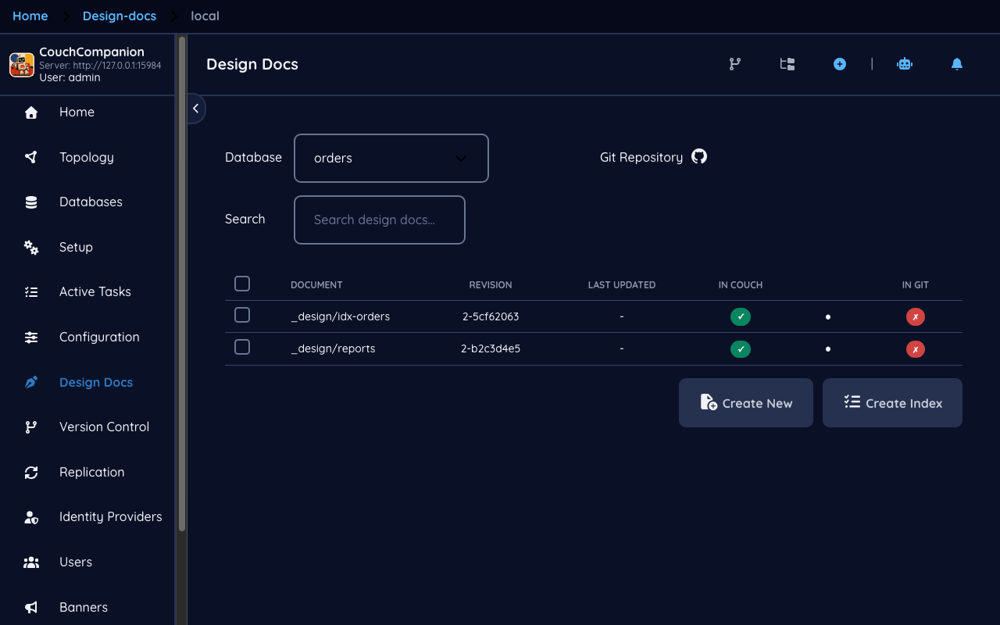
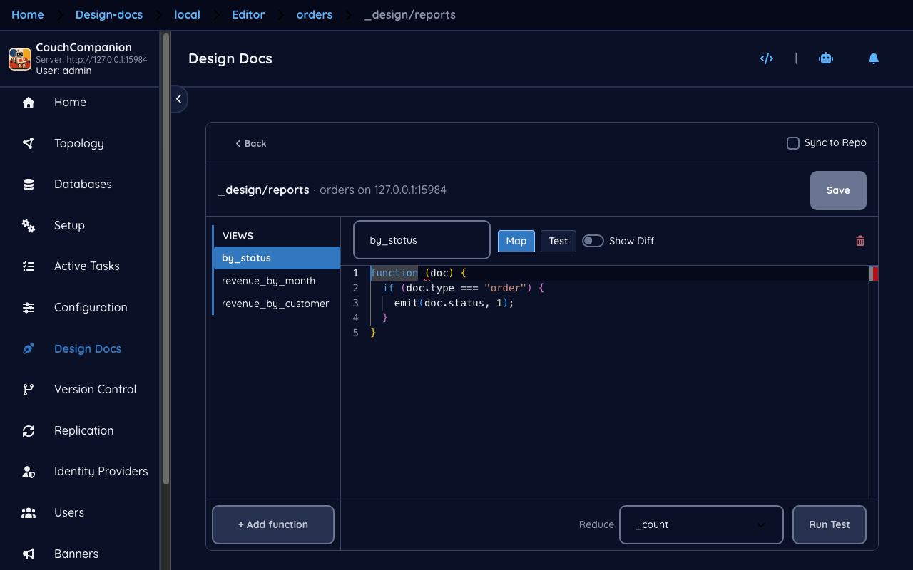
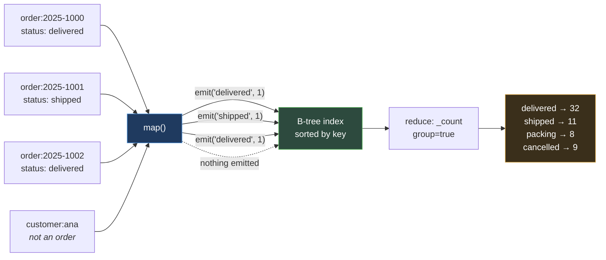
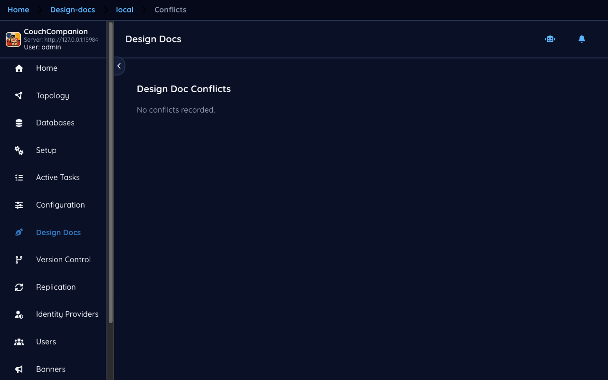

<!--
 Licensed to the Apache Software Foundation (ASF) under one
 or more contributor license agreements.  See the NOTICE file
 distributed with this work for additional information
 regarding copyright ownership.  The ASF licenses this file
 to you under the Apache License, Version 2.0 (the
 "License"); you may not use this file except in compliance
 with the License.  You may obtain a copy of the License at

   https://www.apache.org/licenses/LICENSE-2.0

 Unless required by applicable law or agreed to in writing,
 software distributed under the License is distributed on an
 "AS IS" BASIS, WITHOUT WARRANTIES OR CONDITIONS OF ANY
 KIND, either express or implied.  See the License for the
 specific language governing permissions and limitations
 under the License.
-->

# 5. Design documents and views

[← Queries](04-queries.md) · [Index](README.md) · [Next: Replication →](06-replication.md)

## What a design document is

A **design document** is an ordinary document whose `_id` begins with `_design/`. What makes it
special is that CouchDB reads its contents as code: views, filters, update handlers and validation
functions. Because it is a document, it replicates with the database — your queries travel with
your data, which is one of CouchDB's more distinctive ideas.

**Design Docs** lists them per database. Pick a database and you get the design documents in it.



The demo's `orders` database has three: `_design/reports`, which is hand-written and holds the
views below, and `_design/idx-orders` and `_design/idx-customers`, which the
[index screen](04-queries.md) generated.

The **IN COUCH** and **IN GIT** columns belong to [Version control](08-version-control.md) — they
show whether each design document exists on the server, in a linked Git repository, or both.

## Views, and what map/reduce means

Open a design document to reach the view editor.



The left column lists the views in this design document — `by_status`, `revenue_by_month`,
`revenue_by_customer` — and the tabs above the code switch between the kinds of function a design
document can hold: **View**, **Filter**, **Update**, **Validate**.

> **New to CouchDB — map and reduce**
> A view is built from a **map** function that CouchDB runs over every document, once, and then
> incrementally as documents change. The function calls `emit(key, value)` for each row it wants
> in the index. Documents it ignores produce nothing.
>
> ```javascript
> function (doc) {
>   if (doc.type === 'order') {
>     emit(doc.status, 1);
>   }
> }
> ```
>
> The result is a B-tree sorted by key, which is why views are fast to query and fast to range
> over — asking for every order between two dates is a seek, not a scan.
>
> An optional **reduce** function then aggregates values that share a key. You will usually want
> one of the three built-ins rather than your own: `_count`, `_sum`, `_stats`.

Put together, that is the whole pipeline:



The demo's three views are deliberately ordinary: `by_status` counts orders per status,
`revenue_by_month` sums order totals keyed by `YYYY-MM`, and `revenue_by_customer` sums them by
customer name. Between them they cover the two things you will actually do with reduce — count
things, and add things up.

## Test before you save

The **Test** button beside **Map** is the reason to build views here rather than by editing the
raw JSON.

A map function is JavaScript that CouchDB runs inside its own query server, over every document in
the database. A mistake is not a syntax error you see immediately — it is a view that silently
emits nothing, or emits the wrong key, and you find out when a report is empty. Testing runs your
function against real documents from the database and shows what it emits, before it is saved and
before CouchDB begins building an index from it.

**Show Diff** compares what is in the editor with what is stored, which is the check worth making
before overwriting a view somebody else may have changed.

**Switch to Raw JSON** drops to editing the whole design document by hand — necessary for the
parts the structured editor does not model, and the fastest way to break a design document, so
prefer the structured view when it will do.

> **Saving a view rebuilds its index.** Changing any function in a design document invalidates
> every view in it, and CouchDB rebuilds them from scratch on the next query. On a large database
> that is minutes of slow queries. Common practice is to develop against a copy, or to publish a
> new design document under a new name and switch readers over once it has built.

## Conflicts

**Design Docs → Conflicts** reports design documents that differ between CouchDB and a linked Git
repository.



In the demo it is empty — "No conflicts recorded" — because no repository is connected. That is
the normal state, and the wording is deliberate: it says nothing has been *recorded*, not that no
conflict *exists*, because the screen only knows about conflicts a sync has noticed.

This is a different thing from the CouchDB document conflicts in
[Documents](03-documents.md#conflicts-and-why-they-are-normal). Those are two revisions of one
document inside CouchDB. These are one design document that has drifted between two systems.
[Version control](08-version-control.md) is where they arise.

---

Next: [Replication →](06-replication.md) — copying data between servers, which is the feature the
rest of CouchDB is arguably built around.
