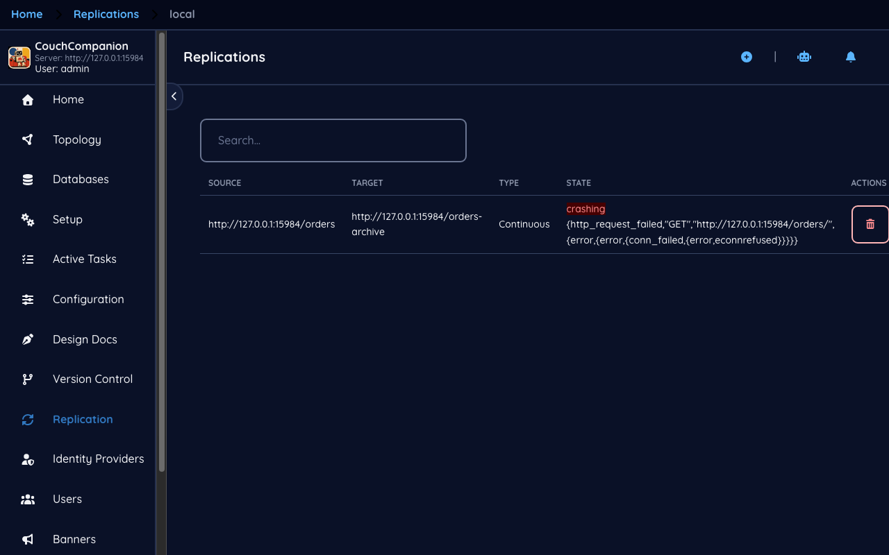
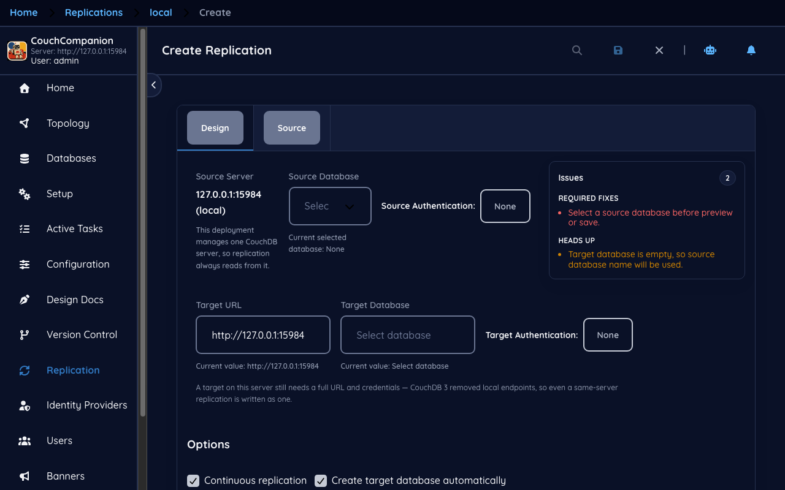
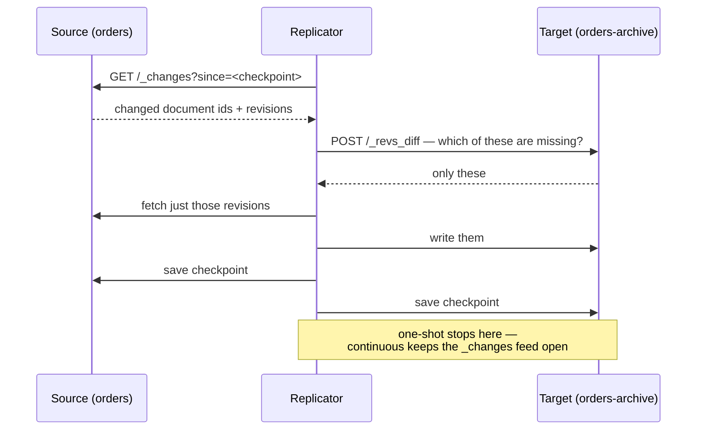
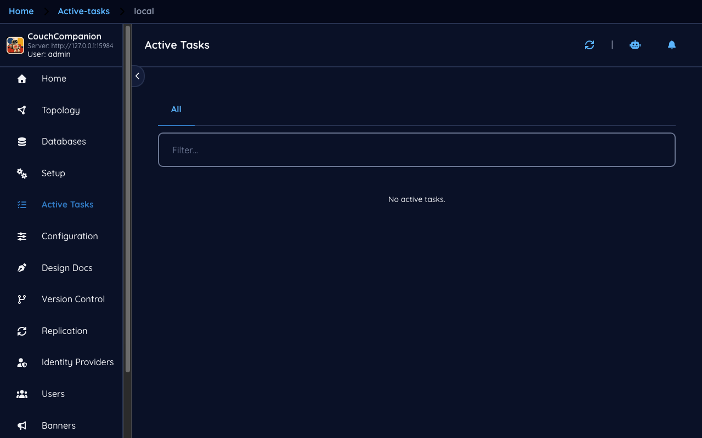

<!--
 Licensed to the Apache Software Foundation (ASF) under one
 or more contributor license agreements.  See the NOTICE file
 distributed with this work for additional information
 regarding copyright ownership.  The ASF licenses this file
 to you under the Apache License, Version 2.0 (the
 "License"); you may not use this file except in compliance
 with the License.  You may obtain a copy of the License at

   https://www.apache.org/licenses/LICENSE-2.0

 Unless required by applicable law or agreed to in writing,
 software distributed under the License is distributed on an
 "AS IS" BASIS, WITHOUT WARRANTIES OR CONDITIONS OF ANY
 KIND, either express or implied.  See the License for the
 specific language governing permissions and limitations
 under the License.
-->

# 6. Replication

[← Design documents](05-design-docs.md) · [Index](README.md) · [Next: Users and roles →](07-users.md)

Replication is the feature the rest of CouchDB is shaped around. It copies documents from a source
database to a target, it is incremental, it survives being interrupted, and it works between any
two CouchDBs that can reach each other — including a CouchDB on a laptop that is offline most of
the time.

## The replication list

Each row is one replication: source, target, type and state. The demo has a single continuous
replication from `orders` into `orders-archive`, `running`.

> **New to CouchDB — replications are documents**
> A replication is a document in the `_replicator` database. Writing the document starts it;
> deleting the document stops it. It follows that replications survive a restart (CouchDB re-reads
> `_replicator` on boot), that they can be inspected with any CouchDB tool, and that the delete
> button on this screen is doing something entirely ordinary.

## Creating one

The editor is sectioned. **Source** comes first, and the source server is fixed with an
explanation — *this deployment manages one CouchDB server, so replication always reads from it*.
Couch Companion administers a single CouchDB; it will push to anywhere, but it always pulls from
the server you are signed in to. The target may be another database on this server or a URL
elsewhere, with its own credentials.

The remaining sections are where the decisions are:

- **Behaviour** — one-shot or continuous, and whether to create the target if it does not exist.
- **Documents** — restrict to an explicit list of document ids.
- **Filter / Selector** — restrict by rule rather than by list, covered below.
- **Query parameters** and **Authentication** — for targets that need them.

**Preview** is worth using before **Create Replication**: it shows what the replication document
will contain, which is both a check on your input and the quickest way to learn what these
settings actually are.

## One-shot or continuous

The important part is the **checkpoint**. Both ends record how far they got, so a replication that
is interrupted resumes from where it stopped rather than starting again, and a one-shot
replication re-run later transfers only what has changed since. This is why replicating a large
database over an unreliable link works at all.

**One-shot** runs until the source has no more changes, then finishes. **Continuous** holds the
changes feed open and keeps going.

Two properties follow from the design and are worth internalising:

- **Replication is one-way.** A ↔ B is two replications, not one. The topology graph on
  [First run](01-first-run.md) colours a database amber when it has both.
- **Conflicts are expected, not exceptional.** If both ends changed the same document, both
  revisions arrive and the document is conflicted. Replication does not merge; see
  [Documents](03-documents.md#conflicts-and-why-they-are-normal).

## Filtered replication

You will often want part of a database rather than all of it — one customer's records to their
own server, or everything except the design documents.

- **A selector** is a Mango selector, evaluated by CouchDB. This is the option to reach for first:
  it is declarative, and CouchDB can apply it efficiently.
- **A filter function** is JavaScript in a design document, run against every change. More
  expressive, considerably slower, and it must exist on the *source*.

Both shrink what crosses the wire, not what is read: the source still walks its changes feed.

## Monitoring

**Active Tasks** shows what the server is doing right now — replications, view builds, compactions
— with progress.

In the demo it reads *No active tasks*, which is the correct answer rather than a broken screen: a
continuous replication that has caught up is idle and is not a running task. It reappears the
moment there is work. A replication that is *failing* also shows here, which makes this the first
screen to open when a replication is not doing what you expect — followed by the state column on
the replication list, and the replication document itself in `_replicator`.

---

Next: [Users and roles →](07-users.md) — accounts, roles, and how CouchDB decides who may do what.
