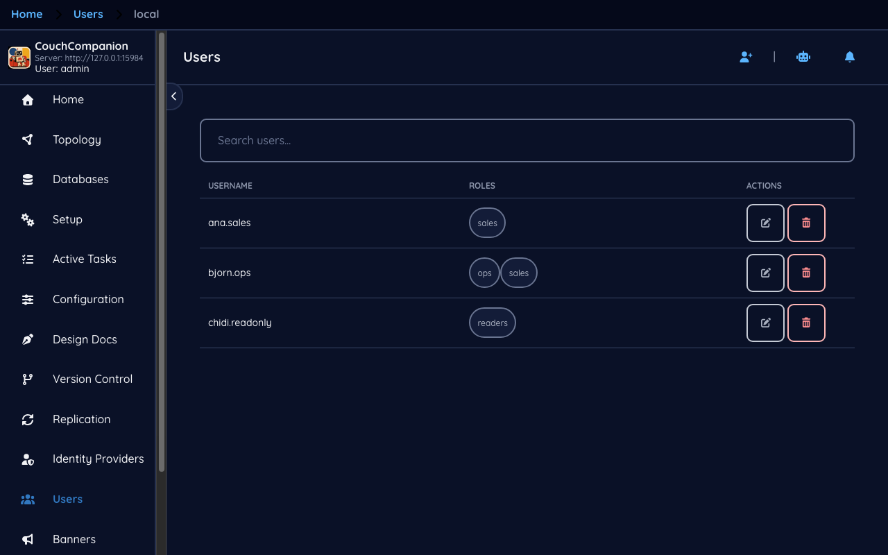
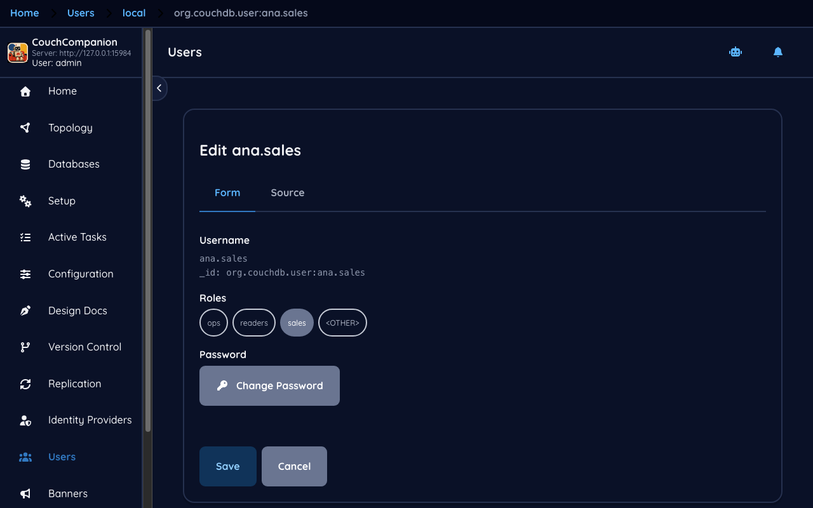
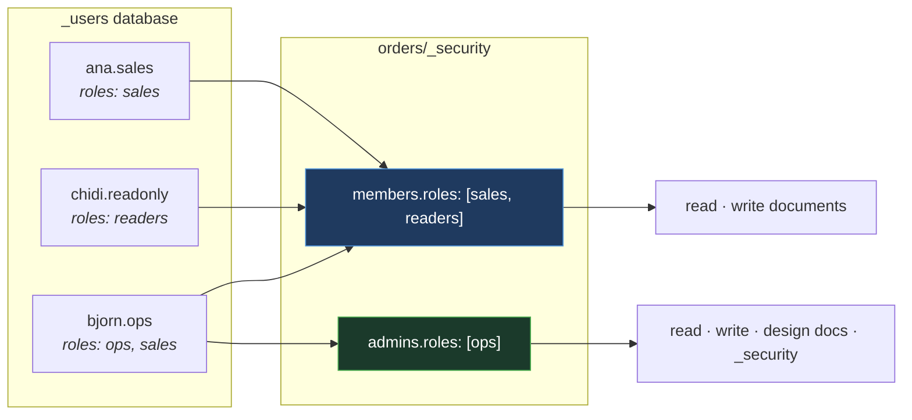

<!--
 Licensed to the Apache Software Foundation (ASF) under one
 or more contributor license agreements.  See the NOTICE file
 distributed with this work for additional information
 regarding copyright ownership.  The ASF licenses this file
 to you under the Apache License, Version 2.0 (the
 "License"); you may not use this file except in compliance
 with the License.  You may obtain a copy of the License at

   https://www.apache.org/licenses/LICENSE-2.0

 Unless required by applicable law or agreed to in writing,
 software distributed under the License is distributed on an
 "AS IS" BASIS, WITHOUT WARRANTIES OR CONDITIONS OF ANY
 KIND, either express or implied.  See the License for the
 specific language governing permissions and limitations
 under the License.
-->

# 7. Users and roles

[← Replication](06-replication.md) · [Index](README.md) · [Next: Version control →](08-version-control.md)

## The user list

Three accounts, each with roles: `ana.sales` has `sales`, `bjorn.ops` has `ops`, `chidi.readonly`
has `readers`.

> **New to CouchDB — there are two kinds of administrator, and they are not the same thing**
>
> - A **server administrator** is configured in CouchDB's `[admins]` section, not in `_users`.
>   They bypass every permission check on every database, can change configuration, and can create
>   and delete databases. The account you were given by `COUCHDB_USER` is one of these.
> - Everyone else is a **user document** in `_users`, holding a name, a password hash and a list
>   of roles. A user becomes an administrator *of a database* by being named in that database's
>   `_security` — which is a different and much smaller power.
>
> This screen manages the second kind. The first kind lives in
> [Configuration](01-first-run.md#configuration).

## A user

The **Form** tab gives username, roles and a password control; **Source** shows the underlying
document. The `_id` is `org.couchdb.user:ana.sales` — CouchDB requires that prefix, and the
username must match the part after it.

**Change Password** writes a new password into the document, where CouchDB hashes it on save. The
plaintext is never stored, and there is no way to read an existing password back — if someone has
lost theirs, you set a new one.

Roles are free-form strings. There is no registry of valid roles and nothing to define in advance;
a role exists because a user has it and a `_security` document mentions it. This is flexible and
slightly dangerous, because `sales` and `Sales` are different roles and nothing will warn you.

## How the pieces fit

Roles are the join between the two halves. Users hold roles; databases grant access to roles.

Add a fourth person to the sales team and you edit one user document. You do not touch
`_security`, and you do not touch it once per database. That is the whole argument for granting
roles rather than names, and it is worth adopting from the first database rather than the tenth.

There are two roles CouchDB defines itself. **`_admin`** is the database-administrator role that
`_security` grants. **`_reader`** appears in older documentation and examples; modern CouchDB
treats any member as a reader.

## Securing a new server

If you have just started a CouchDB, the order that avoids locking yourself out:

1. **Create a server administrator** — in the container image, by setting `COUCHDB_USER` and
   `COUCHDB_PASSWORD` before first start. Until one exists, CouchDB is in *admin party* and every
   request is an admin request.
2. **Confirm the system databases exist** — `_users`, `_replicator`, `_global_changes`. Without
   `_users` you cannot create accounts at all.
3. **Create user accounts with roles**, on this screen.
4. **Set `_security` on every database**, on the [Access](02-databases.md#who-may-read-and-write)
   screen. A database with an empty members list is public, and new databases start empty.

Step 4 is the one that gets forgotten, because everything works without it.

## What this screen cannot do

Passwords here are CouchDB passwords. If your organisation already has an identity provider, you
probably do not want a second set of credentials to manage — that is what
[Identity providers](09-identity.md) is for. The two can coexist: local accounts for break-glass
administration, single sign-on for everyone else.

---

Next: [Version control →](08-version-control.md) — keeping design documents in Git.
