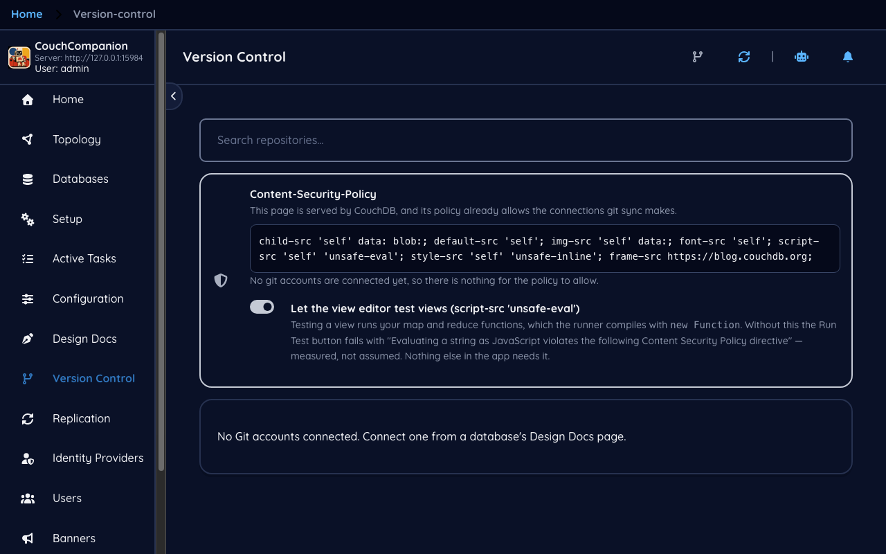
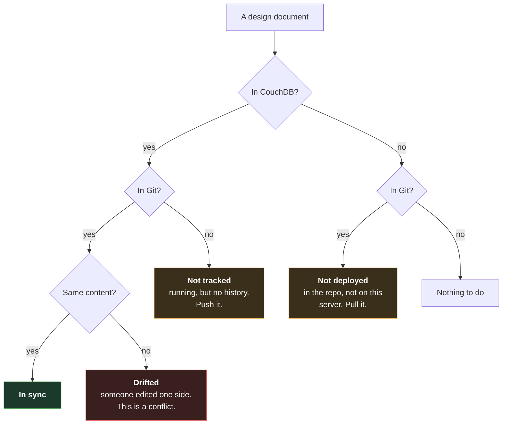

<!--
 Licensed to the Apache Software Foundation (ASF) under one
 or more contributor license agreements.  See the NOTICE file
 distributed with this work for additional information
 regarding copyright ownership.  The ASF licenses this file
 to you under the Apache License, Version 2.0 (the
 "License"); you may not use this file except in compliance
 with the License.  You may obtain a copy of the License at

   https://www.apache.org/licenses/LICENSE-2.0

 Unless required by applicable law or agreed to in writing,
 software distributed under the License is distributed on an
 "AS IS" BASIS, WITHOUT WARRANTIES OR CONDITIONS OF ANY
 KIND, either express or implied.  See the License for the
 specific language governing permissions and limitations
 under the License.
-->

# 8. Version control

[← Users and roles](07-users.md) · [Index](README.md) · [Next: Identity providers →](09-identity.md)

## The problem this solves

Design documents are code. The map functions from [chapter 5](05-design-docs.md) are JavaScript
that decides what your reports say, and they live in a database, edited in a browser, with no
history — remember from [chapter 3](03-documents.md) that `_rev` is not a version history and old
revisions disappear at compaction.

So the ordinary questions have no answer: who changed this view, when, and why? What did it look
like before? Is staging running the same code as production?

**Version Control** answers them by linking design documents to a Git repository.

## Connecting

**Connect Git Account** authorises Couch Companion against a Git host, after which the repository
list fills and you can link one to this server. Once linked, the design document list gains its
two status columns:

- **IN COUCH** — the design document exists on the server.
- **IN GIT** — a file for it exists in the repository.

Between them they give you the four states that matter, and they are visible at a glance on the
[design document list](05-design-docs.md#what-a-design-document-is).

## Pushing and pulling

The [view editor](05-design-docs.md#views-and-what-mapreduce-means) carries a **Sync to Repo**
action; with no repository linked it says *No repository configured*. Once one is, the editor
becomes the place where a change is made, tested and committed in one pass.

The red box is the state to understand before you rely on this. **Drifted** means CouchDB and Git
each hold a different version of the same design document, because someone edited the server
directly while the repository moved on — or the reverse. Couch Companion records these on **Design
Docs → Conflicts**, which is the screen that read *No conflicts recorded* back in
[chapter 5](05-design-docs.md#conflicts): with no repository connected, no sync has run, so nothing
has been noticed.

Resolving one is a judgement call rather than a merge: you look at both versions and decide which
is right. Marking a conflict resolved is an acknowledgement — *I have looked, no further action
needed* — and deliberately changes neither side.

## The Content-Security-Policy panel

This page carries a panel about CSP, and it is not decoration.

CouchDB serves `/_utils/` under a restrictive `Content-Security-Policy`. That policy governs which
origins the page may contact, and Git sync needs to reach a Git host. When the policy allows it,
the panel says so — *this page is served by CouchDB, and its policy already allows the connections
git sync makes* — and shows you the policy.

When it does not, the panel says that instead, and it is worth reading carefully, because a CSP
failure has a distinctive and confusing symptom: **the browser refuses the connection before it is
sent.** Nothing appears in the network tab. There is no timeout and no error from the server,
because no request was made. Without this panel that is a genuinely difficult thing to diagnose.

The fix is a CouchDB configuration change, and
[install.md](../install.md#git-sync-needs-one-more-change-couchdbs-content-security-policy) has the
exact header to write. Couch Companion can apply it for you if you are signed in as a server
administrator, since it is only a config write.

## Worth knowing

- **This versions design documents, not data.** Your orders and customers are not going into Git.
- **It does not replace replication.** Two servers running the same views still need replication
  to hold the same documents.
- **The repository is the audit trail.** Once linked, the useful review question stops being "what
  is on the server" and becomes "what is on the branch" — which is the point.

---

Next: [Identity providers →](09-identity.md) — single sign-on, and the one setting that decides
whether it works at all.
