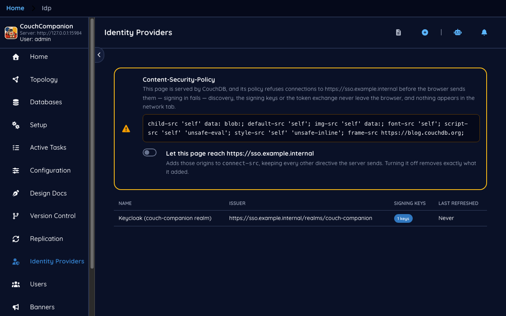
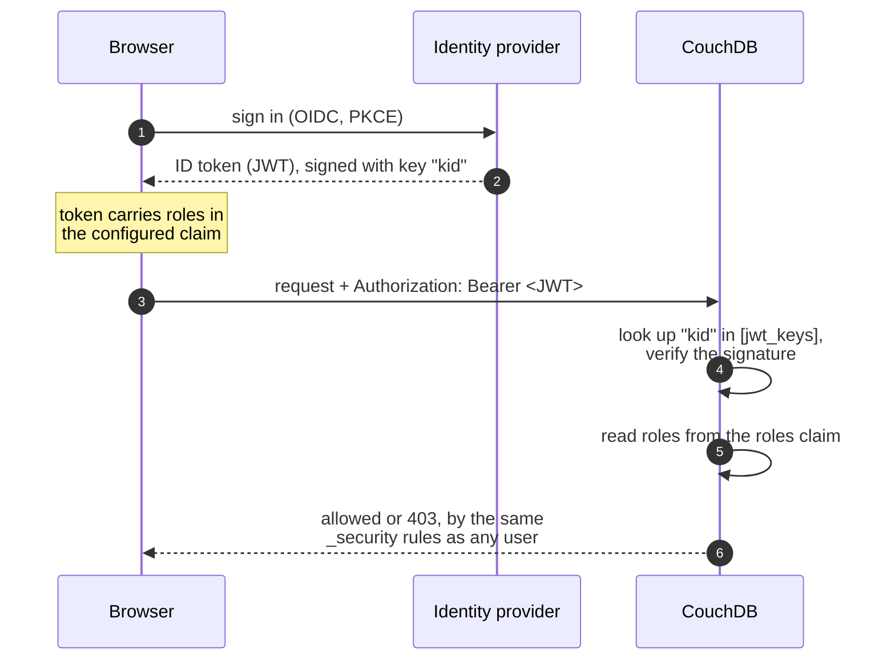
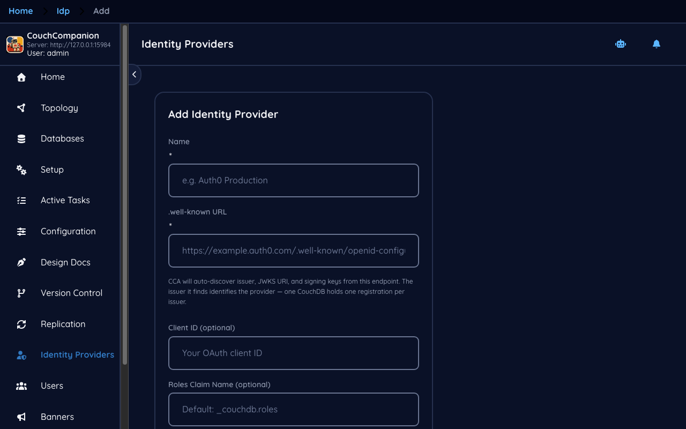
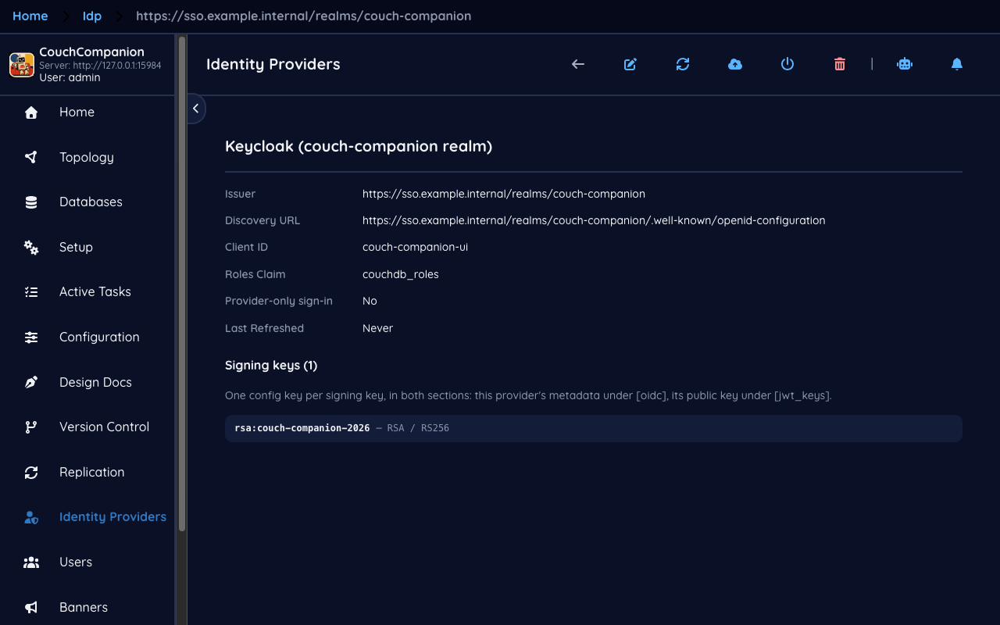
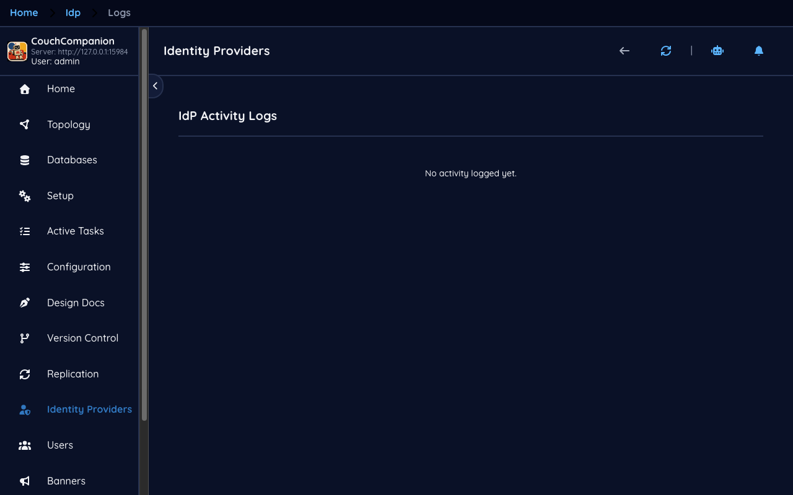

<!--
 Licensed to the Apache Software Foundation (ASF) under one
 or more contributor license agreements.  See the NOTICE file
 distributed with this work for additional information
 regarding copyright ownership.  The ASF licenses this file
 to you under the Apache License, Version 2.0 (the
 "License"); you may not use this file except in compliance
 with the License.  You may obtain a copy of the License at

   https://www.apache.org/licenses/LICENSE-2.0

 Unless required by applicable law or agreed to in writing,
 software distributed under the License is distributed on an
 "AS IS" BASIS, WITHOUT WARRANTIES OR CONDITIONS OF ANY
 KIND, either express or implied.  See the License for the
 specific language governing permissions and limitations
 under the License.
-->

# 9. Identity providers

[← Version control](08-version-control.md) · [Index](README.md)

## Why

[Chapter 7](07-users.md) managed accounts inside CouchDB. That works, and for a small team it may
be all you need. But those are passwords your organisation now has to issue, rotate and revoke,
separately from every other system, and revoking them when someone leaves means remembering that
this CouchDB exists.

Single sign-on removes that. Your identity provider authenticates the person; CouchDB accepts a
signed token as proof and reads the user's roles out of it.

## How it works

The step that surprises people is the last one. **Single sign-on changes only how you prove who
you are.** What you may then do is decided by exactly the same `_security` documents from
[chapter 2](02-databases.md#who-may-read-and-write). A token whose roles claim says `sales` gets
whatever `sales` was granted — nothing more, and nothing automatic.

> **New to CouchDB — what CouchDB actually needs**
> CouchDB does not speak OIDC. It verifies **JWTs**, and to do that it needs one thing: the
> provider's public signing key, in its `[jwt_keys]` configuration, under the same `kid` the token
> names. Everything else — discovery, the redirect, PKCE — happens in the browser. That is what
> these screens automate: fetch the provider's metadata, fetch its keys, write them where CouchDB
> looks.

## Registering one

The form asks for very little, because most of it is discovered:

- **Name** — a label for this screen.
- **.well-known URL** — the provider's OpenID configuration endpoint. Couch Companion fetches it
  and auto-discovers the issuer, the JWKS URI and the signing keys. **The issuer it finds is the
  provider's identity here** — one CouchDB holds one registration per issuer.
- **Client ID** — optional, for a public PKCE client, which has no secret to store.
- **Roles claim** — the claim in the token that carries CouchDB roles. The demo uses
  `couchdb_roles`.

**Roles claim is the setting that decides whether any of this is useful.** Authentication will
succeed without it being right; the person will be signed in, hold no roles, and be denied
everything. If single sign-on "works but nobody can see anything", this is the field to check
first, and it must match what your provider actually puts in the token — you may need to configure
the provider to emit that claim at all.

The detail screen shows the discovered configuration and the signing keys, each with whether it is
**installed** — that is, present in CouchDB's `[jwt_keys]`. A key that is discovered but not
installed will verify nothing. Providers rotate keys, so this screen also refreshes them.

## The Content-Security-Policy trap

The demo's IdP list carries a warning, and it is the single most valuable thing on this page:

> *This page is served by CouchDB, and its policy refuses connections to
> `https://sso.example.internal` before the browser sends them — signing in fails — discovery, the
> signing keys or the token exchange never leave the browser, and nothing appears in the network
> tab.*

CouchDB serves `/_utils/` with a `Content-Security-Policy` of `default-src 'self'`. Your identity
provider is not `'self'`. The browser therefore blocks discovery, the JWKS fetch and the token
exchange — **before sending them**, which is why the symptom is so hard to place: no request in
the network tab, no error in the CouchDB log, no timeout. Just failure.

Couch Companion checks for this and tells you, rather than letting you discover it during a
rollout. Adding the provider's origin to CouchDB's CSP is a configuration change;
[install.md](../install.md#couchdbs-own-csp-has-to-allow-the-idp-too) has the header.

The same trap catches [Git sync](08-version-control.md#the-content-security-policy-panel), for the
same reason.

## Logs

**Logs** records sign-in activity, and it is **off by default** — `[oidc] log` is unset, and with
it unset nothing is written anywhere. That default is deliberate: turning it on is what creates
the `couchcompanion` database, and this application does not create databases behind your back.

Turn it on when you are diagnosing a sign-in problem; leave it off otherwise.

## Rolling it out

An order that does not lock anybody out:

1. **Keep a local server administrator.** Configure single sign-on *alongside* password login, not
   instead of it. If the provider is unreachable, that account is how you get back in.
2. **Fix the CSP first**, or nothing else will work and the symptom will tell you nothing.
3. **Register the provider** and confirm its keys show as installed.
4. **Make the provider emit the roles claim**, and check a real token contains it.
5. **Grant those roles** in each database's `_security` — see
   [chapter 2](02-databases.md#who-may-read-and-write).
6. **Only then** consider *IdP only*, which hides the password form on the login screen.

Step 6 last, and only once step 1 has been tested by actually signing in with it.

---

That is the tour. Back to the [index](README.md), or to [install.md](../install.md) for deployment
and configuration reference.
