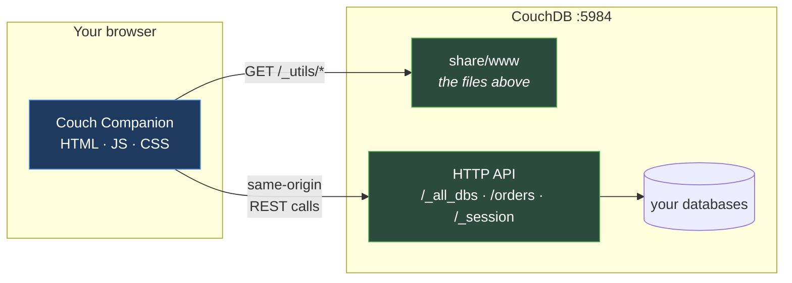

<!--
 Licensed to the Apache Software Foundation (ASF) under one
 or more contributor license agreements.  See the NOTICE file
 distributed with this work for additional information
 regarding copyright ownership.  The ASF licenses this file
 to you under the Apache License, Version 2.0 (the
 "License"); you may not use this file except in compliance
 with the License.  You may obtain a copy of the License at

   https://www.apache.org/licenses/LICENSE-2.0

 Unless required by applicable law or agreed to in writing,
 software distributed under the License is distributed on an
 "AS IS" BASIS, WITHOUT WARRANTIES OR CONDITIONS OF ANY
 KIND, either express or implied.  See the License for the
 specific language governing permissions and limitations
 under the License.
-->

# A walk through Couch Companion

This is a tour of every screen in Couch Companion, written for an administrator who is new to
**both** this application and to CouchDB itself. Where a screen exposes a CouchDB idea for the
first time — a revision, a view, a replication checkpoint — the idea is explained there, at the
point it first matters, rather than in a chapter of theory you have to read first.

If you have run CouchDB before, skim; the CouchDB explanations are set apart so they are easy to
skip.

## What Couch Companion is

CouchDB ships with an admin UI called Fauxton, served from its own `share/www` directory at
`/_utils/`. Couch Companion replaces the contents of that directory. That is the entire
integration: there is **no server component, no database of its own, and no process to keep
running**. Your browser fetches static files from CouchDB and then talks to CouchDB's HTTP API
directly.



Two consequences are worth holding onto, because most of what follows depends on them:

- **The UI can never do more than your login can.** Every button is an HTTP request made as you.
  If CouchDB says 403, the screen says 403. Permissions are enforced by the database, not by this
  application.
- **There is nothing to back up.** Couch Companion holds no state. Replace the files, or delete
  them and restore Fauxton, and no data is affected.

## The guided path

Read in order for a tour; jump straight in if you know what you are looking for.

| | Page | What it covers |
|---|---|---|
| 1 | [First run](01-first-run.md) | Signing in, the shell, the topology view, server configuration |
| 2 | [Databases](02-databases.md) | Creating databases, the system databases, who may read and write |
| 3 | [Documents](03-documents.md) | The document browser and editor, `_rev`, and what MVCC means for you |
| 4 | [Queries and indexes](04-queries.md) | Mango selectors, the query builder, and making queries fast |
| 5 | [Design documents and views](05-design-docs.md) | Map/reduce, the view editor and tester, conflicts |
| 6 | [Replication](06-replication.md) | One-shot and continuous replication, filters, monitoring |
| 7 | [Users and roles](07-users.md) | Accounts, roles, and how CouchDB decides who may do what |
| 8 | [Version control](08-version-control.md) | Keeping design documents in Git |
| 9 | [Identity providers](09-identity.md) | Single sign-on with OIDC, and the roles claim |

## The example used throughout

Every screenshot comes from the same small demo: an online furniture retailer with three
databases — `customers`, `orders` and `products` — a handful of views, two Mango indexes, three
user accounts, and one continuous replication into `orders-archive`. The numbers in the pictures
are consistent from page to page, so a figure in chapter 6 refers to the same 60 orders you met in
chapter 3.

You do not need this data to follow along, but if you would like to click through the same screens
yourself, `scripts/screenshots.mjs` builds it from nothing:

```
node scripts/screenshots.mjs --keep
```

That starts a throwaway CouchDB with Couch Companion already installed, seeds the demo, captures
every picture in this walkthrough, and leaves the server running at
`http://127.0.0.1:15984/_utils/` (`admin` / `companion`). Remove it with
`docker rm -f couch-companion-walkthrough`. Nothing it does touches a CouchDB of your own.

## Before you start

This walkthrough assumes Couch Companion is already installed. If it is not, see
[install.md](../install.md) — the shortest route is the container image, which needs no existing
CouchDB:

```
docker run -d --name couch-companion -p 5984:5984 \
  -e COUCHDB_USER=admin -e COUCHDB_PASSWORD=<choose one> \
  -v couchdb_data:/opt/couchdb/data \
  ghcr.io/hcl-tech-software/couch-companion:latest
```

Then open <http://127.0.0.1:5984/_utils/> and start at [First run](01-first-run.md).

---

*Screenshots are generated, not taken by hand — see `scripts/screenshots.mjs`. If a screen here no
longer matches the application, re-run that script rather than editing the images.*
